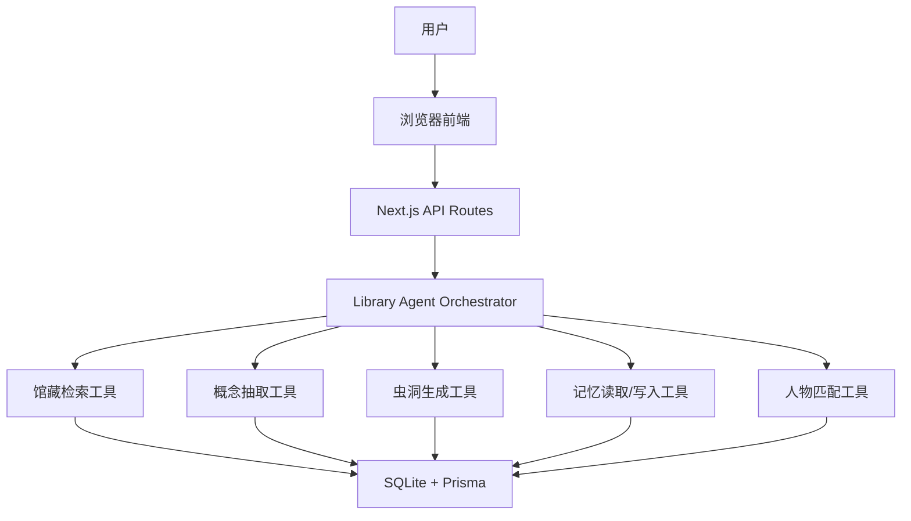

# Wormhole Library Agent 中文工程设计文档

版本：1.3  
用途：直接喂给 Claude Code 做 harness engineering / MVP 实现  
项目定位：图书馆垂类 Agent + 可控知识偶遇 + 长期反馈记忆  
默认队伍：三人团队，其中你包含在三人之中，并主要负责架构整合、统筹验收与 Demo 闭环  

## 0. 给 Claude Code 的先行约束

这不是概念策划文档，而是工程执行文档。Claude Code 必须产出一个能本地运行、能现场演示、能通过测试的 MVP。

必须遵守：

1. 产品主体必须是“图书馆垂类 Agent”，不是泛知识推荐系统。
2. Knowledge Wormhole、Knowledge Collision、Living Library、Serendipity Slider、Unknown Unknowns、反馈记忆都必须服务于图书馆场景。
3. 每条虫洞最后必须落到馆藏资源、论文、课程、书架位置或 Living Library 人物资源上。
4. 反馈记忆必须真实改变下一次推荐结果，不能只写入日志。
5. 人物匹配必须有显式同意和匿名保护，不能默认暴露身份。
6. MVP 采用单体 Web 应用，避免过早引入 Neo4j、Qdrant、独立 FastAPI、多服务编排和真实消息系统。

## 1. 这个 Agent 运行在什么上

### 1.1 运行形态

Wormhole Library Agent 在 MVP 阶段运行在一个本地或云端可部署的 Web 应用上。

用户看到的是：

```text
浏览器里的图书馆 AI Agent
```

工程上它由三层组成：

```text
浏览器前端
  -> Next.js API Routes
  -> Library Agent Orchestrator
  -> 内部工具函数与数据库
```

也就是说，这个 Agent 不是单独运行在 Claude、ChatGPT 或某个聊天窗口里。Claude Code 只是开发工具，负责把项目实现出来。真正的 Wormhole Agent 运行在项目自己的 Web 服务中。

### 1.2 推荐 MVP 技术栈

| 层级 | 选择 | 原因 |
|---|---|---|
| 前端 | Next.js App Router + React + TypeScript | 页面、API、服务端逻辑可以放在一个项目里，黑客松最稳 |
| 后端 | Next.js API Routes | 不额外起 FastAPI，减少部署复杂度 |
| 数据库 | SQLite + Prisma | 本地演示稳定，schema 清晰，后续可迁移 PostgreSQL |
| 知识图谱 | 数据库表 + 内存图搜索 | MVP 不上 Neo4j，先实现可解释路径 |
| 向量/相似度 | 预置 embedding JSON 或确定性伪向量 | 保证无 API Key 也能跑 |
| LLM | OpenAI-compatible Provider 可选 | 只增强解释文本，不承担核心排序 |
| 可视化 | React Flow 或 Cytoscape.js | 展示虫洞路径和知识地图 |
| 测试 | Vitest + Playwright | 算法单测 + 演示链路验收 |

### 1.3 部署形态

MVP 支持两种运行方式：

```text
本地演示：
npm install
npm run db:push
npm run db:seed
npm run dev
http://localhost:3000
```

```text
云端部署：
Vercel / Railway / Render
SQLite 可替换为 PostgreSQL
```

黑客松现场优先保证本地演示稳定。云端部署是加分项，不是第一优先级。

### 1.4 Agent 的本质

Wormhole Agent 是一个“工具编排器”，不是一个只会调用 LLM 的聊天机器人。

它的核心循环是：

```text
理解用户任务
  -> 调馆藏检索工具
  -> 调概念图谱工具
  -> 调虫洞生成工具
  -> 调记忆读取工具
  -> 调人物匹配工具
  -> 生成可解释结果
  -> 接收反馈
  -> 编译成结构化记忆
```

## 2. 赛题映射

| 赛题 | 在 Wormhole 中的角色 | 对应功能 |
|---|---|---|
| 赛道 2：图书馆超进化 | 产品主体 | AI 馆员、馆藏检索、知识地图、沉睡书籍重新发现、人与图书馆空间连接 |
| 赛道 3：制造一点意外 | 创新机制 | Knowledge Wormhole、Serendipity Slider、Unknown Unknowns、Knowledge Collision |
| 赛道 4：反馈记忆 Agent | 底层能力 | 记住用户阅读偏好、知识距离偏好、难度承受度、人物匹配偏好，并在后续任务自动调用 |

一句话关系：

```text
赛道 2 是身体，赛道 3 是性格，赛道 4 是记忆。
```

产品 UI 中不要写“我们融合了赛道 2/3/4”。这是答辩话术，不是用户语言。

## 3. 产品定义

Wormhole Library Agent 是一个具有长期反馈记忆和可控知识偶遇能力的图书馆垂类 Agent。

它既能像传统馆员一样完成检索、找书、论文研究和阅读规划，又能理解用户长期的知识结构与阅读习惯，在合适的时候主动打开一条通往陌生知识领域的“虫洞”。

### 3.1 核心价值

传统图书馆检索解决：

```text
我知道我要找什么
```

普通推荐系统解决：

```text
推荐更多我已经喜欢的东西
```

Wormhole 解决：

```text
我不知道自己还应该知道什么
```

### 3.2 目标用户

1. 正在写课程论文的本科生。
2. 正在找研究方向的研究生。
3. 只知道模糊兴趣、不会构造检索词的学生。
4. 希望在图书馆里找到书、论文、课程和人的学习者。
5. 愿意把自己的经验开放成 Living Library 的同学。

## 4. 核心概念

### 4.1 Knowledge Wormhole：知识虫洞

从用户当前主题出发，沿着一条可解释的知识路径，跳到一个用户原本不会搜索但确实相关的馆藏或人物资源。

示例：

```text
Multi-Agent Systems
  -> Agent Coordination
  -> Game Theory
  -> Mechanism Design
  -> 图书馆馆藏：《An Introduction to Game Theory》
```

每条虫洞必须包含：

1. 起点概念。
2. 3 到 5 个桥接概念。
3. 目标概念。
4. 目标馆藏、论文、课程或 Living Library 人物。
5. 用人话解释为什么这条跳跃成立。
6. Novelty、Bridge、Quality、Final Score。

### 4.2 Serendipity Slider：意外度滑块

用户控制今天想离知识舒适区多远。

| 区间 | 文案 | 含义 |
|---:|---|---|
| 0-20 | 附近书架 | 同领域新资料 |
| 21-40 | 隔壁书架 | 相邻领域 |
| 41-60 | 跨过楼层 | 明显跨学科 |
| 61-80 | 另一栋楼 | 较远，但有清晰桥梁 |
| 81-100 | 把我扔进深空 | 高意外度探索，但仍不能随机 |

算法约束：

```text
target_novelty = slider_value / 100
```

滑块必须真实参与排序。

### 4.3 Unknown Unknowns：未知的未知

系统主动发现用户连关键词都不知道的领域。

示例：

用户输入：

```text
我想了解 Agent Memory
```

普通推荐：

```text
LangGraph Memory
Vector DB
RAG
Long Context
```

Wormhole 额外发现：

```text
人类长期记忆
认知心理学
遗忘曲线
个人信息管理
```

这些方向不是随机的，它们通过知识桥与用户当前主题相连。

### 4.4 Knowledge Collision：知识碰撞

让两个“不应该认识的人”因为知识结构的互补而相遇。

不是找最相似的人，而是找有价值的差异。

示例：

```text
用户 A：Multi-Agent Coordination
用户 B：Mechanism Design
桥梁：多个主体如何在规则下行动
价值：A 带来 Agent 实现视角，B 带来机制设计视角
```

### 4.5 Living Library：每个人都是一本书

图书馆不只收藏书和论文，也收藏愿意分享经验的人。

Living Library 人物资源必须是 opt-in：

```text
我愿意作为匿名或实名“活馆藏”，被别人搜索到，用于回答某些主题的问题。
```

返回结果可以长这样：

```text
3 本书
5 篇论文
1 门课程
2 位 Living Library 同学
```

### 4.6 反馈记忆

用户反馈不只是保存聊天记录，而是被编译成 Agent 行为规则。

示例：

```text
用户反馈：这个方向很有趣，但数学太难了。
```

系统记忆：

```json
{
  "serendipity.likedDomains": ["Economics"],
  "difficulty.mathTolerance": 0.38,
  "reading.summaryFirst": true
}
```

## 5. 用户流程

### 5.1 第一次使用

```text
用户打开首页
  -> 输入：我想做一个 AI Agent 项目，但刚入门
  -> 选择目标：项目
  -> 选择水平：入门
  -> Wormhole 返回基础馆藏和阅读路径
  -> 用户拖动意外度滑块到 70
  -> 系统生成 3 条知识虫洞
  -> 用户点击“机制设计”虫洞
  -> 系统展示知识桥和馆藏位置
  -> 用户反馈：有趣，但数学太难
  -> 系统更新记忆
```

### 5.2 第二次使用

```text
用户输入：帮我找 Agent Memory 的资料
  -> 系统读取记忆：
     中文/综述优先
     喜欢跨学科
     数学难度中等偏低
  -> 系统先给基础书籍和综述
  -> 再主动给一条更适合的虫洞：
     Agent Memory -> Human Memory -> Cognitive Psychology -> Forgetting Curve
```

### 5.3 人物匹配流程

```text
用户研究：多智能体协作
  -> 系统发现匿名候选人：研究机制设计的同学
  -> 系统解释碰撞理由
  -> 用户点击“请求 15 分钟交流”
  -> 对方同意前不显示身份和联系方式
  -> 双方同意后才进入联系流程
```

## 6. MVP 边界

### 6.1 必须实现

1. 图书馆 Agent 首页。
2. 馆藏资源检索结果。
3. 阅读路径生成。
4. Serendipity Slider。
5. 虫洞路径生成和排序。
6. Unknown Unknowns 卡片。
7. 反馈按钮和自由文本反馈。
8. 结构化记忆更新。
9. Living Library 人物资源。
10. Knowledge Collision 匹配卡。
11. 隐私安全的联系人请求假流程。
12. 单元测试和一条端到端 Demo 流程。

### 6.2 可以模拟，但必须有接口边界

| 模块 | MVP 做法 | 后续替换 |
|---|---|---|
| 图书馆馆藏 | seed 数据 | 接真实图书馆 API |
| 论文数据 | seed 数据 | 接 Semantic Scholar / Crossref / 学校数据库 |
| embedding | 预置 JSON 或伪向量 | 接真实 embedding 模型 |
| LLM | 可选，没有 Key 时走模板 | 接 OpenAI-compatible 模型 |
| 消息系统 | 本地 contact request 表 | 接邮件/飞书/微信/校园系统 |

### 6.3 不做

1. AR 找书。
2. 真实用户登录系统。
3. 真实消息推送。
4. Neo4j 大图数据库。
5. Qdrant 向量数据库。
6. 自动导入用户全部浏览历史。
7. 复杂多 Agent 公司架构。

## 7. 系统架构



核心原则：

1. 排序和路径生成必须是确定性代码。
2. LLM 只负责润色解释，不负责唯一正确性。
3. 没有 LLM API Key 时，Demo 仍然完整可运行。
4. 所有工具必须有类型定义和测试。

## 8. 工具设计

| 工具 | 作用 | MVP 要求 |
|---|---|---|
| `extractConcepts` | 从用户问题抽取概念 | 关键词/别名匹配，LLM 可选 |
| `searchCatalog` | 检索图书、论文、课程 | 必须返回资源卡 |
| `rankLibraryResources` | 根据任务、难度、记忆排序 | 必须可测试 |
| `generateReadingPath` | 生成基础学习路径 | 从概念边构造 |
| `generateWormholes` | 生成虫洞候选路径 | 必须落到资源 |
| `rankWormholes` | 根据滑块和记忆排序 | 滑块必须影响结果 |
| `findUnknownUnknowns` | 找用户未搜索但相关的领域 | 基于 novelty + bridge |
| `findKnowledgeCollisions` | 找互补人物 | 必须检查同意状态 |
| `searchLivingLibrary` | 检索活馆藏人物 | 只返回 opt-in 用户 |
| `compileFeedbackMemory` | 把反馈编译成记忆 patch | 必须改变后续行为 |
| `recordInteraction` | 记录一次交互 | 用于调试和验收 |

## 9. 数据模型

核心实体：

```text
User
Concept
ConceptEdge
LibraryResource
ResourceConcept
LivingBookProfile
LivingBookConcept
UserMemory
Interaction
Feedback
WormholeRun
WormholePath
PersonMatch
ContactRequest
```

### 9.1 Concept

```ts
type Concept = {
  id: string;
  name: string;
  aliases: string[];
  domain: string;
  description: string;
  embedding: number[];
  popularity: number;
};
```

### 9.2 LibraryResource

```ts
type LibraryResource = {
  id: string;
  type: "book" | "paper" | "course" | "thesis";
  title: string;
  authors: string[];
  language: "zh" | "en";
  location?: string;
  callNumber?: string;
  availability: "available" | "checked_out" | "online" | "unknown";
  difficulty: "intro" | "undergrad" | "graduate" | "research";
  qualityScore: number;
};
```

### 9.3 LivingBookProfile

```ts
type LivingBookProfile = {
  id: string;
  userId: string;
  displayMode: "anonymous" | "named";
  consentState: "private" | "discoverable_anonymous" | "discoverable_named" | "paused";
  expertiseConceptIds: string[];
  willingTypes: Array<"async_answer" | "coffee_chat" | "project_review" | "reading_guide">;
  availability: Record<string, unknown>;
  helpfulnessScore: number;
};
```

### 9.4 UserMemory

```ts
type UserMemoryItem = {
  id: string;
  userId: string;
  category: "reading" | "difficulty" | "serendipity" | "task" | "social";
  key: string;
  valueJson: unknown;
  confidence: number;
  source: "explicit_feedback" | "implicit_click" | "profile" | "system_inferred";
  useCount: number;
  successCount: number;
};
```

## 10. 推荐与虫洞算法

### 10.1 用户向量

```text
user_vector =
  0.45 * 最近查询概念
  + 0.25 * 点击资源概念
  + 0.20 * 正反馈概念
  + 0.10 * 显式画像概念
```

第一次使用时，只用当前查询概念。

### 10.2 Novelty

```text
similarity = cosine(user_vector, candidate_vector)
novelty = 1 - similarity
target_novelty = slider_value / 100
novelty_fit = 1 - abs(novelty - target_novelty)
```

### 10.3 BridgeScore

从起点概念到目标概念找长度 2 到 5 的路径。

```text
path_strength = average(edge.weight)
path_explainability = 1 - ((path_length - 3)^2 / 9)
bridge_score = 0.65 * path_strength + 0.35 * path_explainability
```

淘汰规则：

```text
bridge_score < 0.35 的候选直接丢弃
没有馆藏或 Living Library 落点的候选直接丢弃
```

### 10.4 QualityScore

```text
quality_score =
  0.45 * 最高资源质量
  + 0.25 * 可获得性
  + 0.20 * 资源数量
  + 0.10 * 难度匹配
```

### 10.5 最终分数

```text
final_score =
  0.40 * bridge_score
  + 0.30 * novelty_fit
  + 0.20 * quality_score
  + 0.10 * diversity_score
```

记忆修正：

```text
目标领域在 likedDomains 中：+0.05
目标领域在 dislikedDomains 中：-0.08
目标需要高数学且 mathTolerance < 0.4：-0.10
用户要求中文优先且资源为中文：+0.04
```

## 11. 人物匹配机制

### 11.1 匹配目标

Wormhole 的人物匹配不是“找兴趣相同的人”，而是找“知识结构有碰撞价值的人”。

匹配类型：

| 类型 | 含义 |
|---|---|
| 相似研究 | 两人研究主题接近 |
| 互补碰撞 | 两人主题不同，但由强桥梁连接 |
| Living Library 导师 | 一人能在合适难度帮助另一人 |
| Unknown Unknowns 向导 | 一人熟悉另一人即将进入的陌生领域 |

MVP 优先做：

```text
互补碰撞 + Living Library 导师
```

### 11.2 CollisionScore

```text
topic_distance = 1 - cosine(A.vector, B.vector)
topic_distance_fit = 1 - abs(topic_distance - 0.55)
bridge_strength = max_bridge_score(A.concepts, B.concepts)
complementarity = B.expertise 与 A.unknown_unknowns 的交集强度
availability = 是否可用
privacy_ok = 双方是否允许

collision_score =
  0.30 * topic_distance_fit
  + 0.30 * bridge_strength
  + 0.25 * complementarity
  + 0.10 * availability
  + 0.05 * 历史反馈适配
```

### 11.3 隐私流程

```text
系统计算匹配
  -> 只展示匿名卡片和碰撞理由
  -> 用户发起联系请求
  -> 对方看到请求
  -> 对方同意后才显示身份或联系方式
```

## 12. Living Library 模型

Living Library 把愿意分享经验的人作为图书馆资源的一部分。

### 12.1 人物状态

| 状态 | 含义 |
|---|---|
| private | 不可发现 |
| discoverable_anonymous | 匿名可发现 |
| discoverable_named | 实名可发现 |
| paused | 暂停展示 |

### 12.2 可提供帮助类型

| 类型 | 含义 |
|---|---|
| async_answer | 接受异步问题 |
| coffee_chat | 接受 15 分钟交流 |
| project_review | 可以看项目想法 |
| reading_guide | 可以推荐入门资料 |

### 12.3 LivingBookScore

```text
living_book_score =
  0.35 * expertise_match
  + 0.20 * difficulty_fit
  + 0.20 * willingness_match
  + 0.15 * availability
  + 0.10 * past_helpfulness
```

## 13. 反馈记忆结构

### 13.1 记忆类别

| 类别 | 记什么 |
|---|---|
| reading | 中文/英文、书/论文、综述优先、一次给几个 |
| difficulty | 数学难度、论文密度、推荐层级 |
| serendipity | 默认滑块、喜欢的跨学科方向、不喜欢的方向 |
| task | 课程作业/科研/项目/考试的资源策略 |
| social | 是否接受人物匹配、是否匿名优先 |

### 13.2 记忆示例

```json
{
  "reading": {
    "language": "zh_first",
    "resourceTypeOrder": ["book", "survey_paper", "paper"],
    "summaryFirst": true
  },
  "difficulty": {
    "preferredLevel": "undergrad",
    "mathTolerance": 0.42
  },
  "serendipity": {
    "defaultSlider": 62,
    "likedDomains": ["Cognitive Science", "Economics"]
  },
  "social": {
    "matchingMode": "ask_first",
    "anonymousFirst": true
  }
}
```

### 13.3 Memory Compiler

把自然语言反馈变成结构化 patch。

```text
反馈：这个虫洞很有趣，但数学太重
```

```json
[
  {
    "key": "serendipity.likedDomains",
    "operation": "add_or_increment",
    "value": "Economics",
    "confidenceDelta": 0.08
  },
  {
    "key": "difficulty.mathTolerance",
    "operation": "decrement",
    "value": 0.08,
    "confidenceDelta": 0.10
  }
]
```

### 13.4 记忆预算

每次 Agent 调用最多注入：

```text
12 条记忆
1200 字符以内
```

记忆选择公式：

```text
memory_relevance =
  0.45 * 任务匹配
  + 0.25 * 置信度
  + 0.15 * 新近程度
  + 0.15 * 历史成功率
```

## 14. 隐私与安全

必须实现：

1. 用户默认不是 Living Library。
2. 人物资料必须 opt-in 才能出现。
3. 匿名匹配不暴露姓名、联系方式、学号。
4. 联系请求必须双方同意。
5. 用户可以关闭社交匹配。
6. 用户可以查看和重置记忆。
7. Demo seed 数据不得使用真实个人隐私。

不能做：

1. 自动推断敏感身份。
2. 未经同意展示“某人会什么”。
3. 把人物匹配做成公开排行榜。
4. 把用户私密反馈展示给其他人。

## 15. API 设计

### 15.1 搜索

`POST /api/search`

```json
{
  "userId": "demo-user",
  "query": "我想入门 AI Agent，准备用它做一个项目",
  "taskType": "project",
  "level": "beginner",
  "sliderValue": 60
}
```

返回：

```json
{
  "interactionId": "int_001",
  "concepts": ["AI Agent", "Tool Use", "Planning"],
  "resources": [],
  "readingPath": ["AI Agent", "Planning", "Tool Use", "Memory", "Multi-Agent"],
  "memoryUsed": ["中文优先", "综述优先"]
}
```

### 15.2 生成虫洞

`POST /api/wormholes`

```json
{
  "userId": "demo-user",
  "interactionId": "int_001",
  "startConceptIds": ["c_ai_agent"],
  "sliderValue": 70,
  "maxPaths": 3
}
```

### 15.3 提交反馈

`POST /api/feedback`

```json
{
  "userId": "demo-user",
  "interactionId": "int_001",
  "targetType": "wormhole",
  "targetId": "wh_001",
  "rating": "too_hard",
  "freeText": "方向很有趣，但数学太难"
}
```

### 15.4 查询记忆

`GET /api/memory?userId=demo-user`

### 15.5 人物匹配

`POST /api/matches`

```json
{
  "userId": "demo-user",
  "conceptIds": ["c_multi_agent_coordination"],
  "mode": "collision"
}
```

### 15.6 联系请求

`POST /api/contact-requests`

```json
{
  "userId": "demo-user",
  "personMatchId": "pm_001",
  "message": "我正在做多智能体项目，想约 15 分钟交流。"
}
```

## 16. 数据库 schema

Claude Code 应在 `prisma/schema.prisma` 中实现以下模型：

```text
User
Session
Concept
ConceptEdge
LibraryResource
ResourceConcept
LivingBookProfile
LivingBookConcept
UserMemory
Interaction
Feedback
WormholeRun
WormholePath
PersonMatch
ContactRequest
```

实现时可以参考英文版文档中的 Prisma schema，但最终 README 和注释应使用中文或中英混合的清晰命名说明。

## 17. 前端页面

### 17.1 `/`

图书馆 Agent 首页。

必须包含：

1. 主输入框。
2. 任务类型选择。
3. 难度选择。
4. Demo 示例。
5. 进入探索按钮。

首页不是营销页，第一屏必须能直接使用。

### 17.2 `/explore/[interactionId]`

核心探索页。

必须包含：

1. 普通馆藏结果。
2. 阅读路径。
3. Serendipity Slider。
4. 虫洞卡片。
5. Unknown Unknowns。
6. Living Library / Knowledge Collision 卡片。
7. 反馈栏。
8. 记忆更新提示。

### 17.3 `/map/[interactionId]`

知识地图页。

展示：

```text
当前主题
桥接概念
目标概念
馆藏资源
Living Library 人物
```

### 17.4 `/memory`

记忆透明页。

用户可以：

1. 查看当前偏好。
2. 查看最近记忆更新。
3. 重置 Demo 记忆。
4. 关闭人物匹配。
5. 调整默认意外度。

### 17.5 `/living-library`

活馆藏设置页。

用户可以：

1. 开启或关闭可发现状态。
2. 选择匿名或实名。
3. 添加擅长主题。
4. 选择愿意帮助的方式。
5. 查看联系请求。

## 18. Repo 结构

```text
wormhole-library-agent/
  app/
    page.tsx
    explore/[interactionId]/page.tsx
    map/[interactionId]/page.tsx
    memory/page.tsx
    living-library/page.tsx
    api/
      search/route.ts
      wormholes/route.ts
      feedback/route.ts
      memory/route.ts
      matches/route.ts
      contact-requests/route.ts
  components/
    LibrarianSearchBox.tsx
    ResourceCard.tsx
    SerendipitySlider.tsx
    WormholeCard.tsx
    KnowledgeMap.tsx
    MemoryPanel.tsx
    LivingBookCard.tsx
    FeedbackBar.tsx
  lib/
    agent/
      orchestrator.ts
      tools.ts
    catalog/
      adapter.ts
      seedCatalogAdapter.ts
      ranking.ts
    concepts/
      conceptExtraction.ts
      graph.ts
      vectors.ts
    wormhole/
      generate.ts
      score.ts
      paths.ts
    memory/
      getMemory.ts
      compileFeedback.ts
      applyPatch.ts
    matching/
      collision.ts
      livingLibrary.ts
      consent.ts
    llm/
      provider.ts
      deterministicProvider.ts
      openaiCompatibleProvider.ts
    db/
      prisma.ts
  prisma/
    schema.prisma
    seed.ts
  data/
    seed-concepts.json
    seed-edges.json
    seed-resources.json
    seed-living-books.json
  tests/
    unit/
    e2e/
  docs/
    demo-script.md
    responsibility-packages.md
  README.md
```

## 19. 三人责任包划分

本项目按“三人团队”划分，三人包含你本人。你主要负责架构整合、主应用闭环、接口冻结、验收统筹和 Demo harness；另外两名队友分别负责资源 grounding / Living Library，以及虫洞算法 / 反馈记忆。

实际执行时，以 `outputs/responsibility-packages/` 下的三份责任子文档为准：

1. `package-01-owner-integration.md`：你的任务包。
2. `package-02-library-grounding-living-library.md`：队友一任务包。
3. `package-03-wormhole-memory-algorithm.md`：队友二任务包。

下面保留的是设计阶段的模块拆解参考，不作为最终人员分配依据。最终人员边界、交付物和验收标准均以三份子文档为准。

分工原则来自数模分工 skill：每个包都必须是完整闭环，包含主优化目标、独立技术决策、实现、实验矩阵、结果解释和可验收交付物。禁止把某个人只分成“画图”“润色”“跑一下测试”。

### 19.1 你的职责：总负责人 / 架构整合 / Demo 统筹

| 项目 | 内容 |
|---|---|
| 分配对象 | 你 |
| 责任范围 | 项目架构、接口冻结、任务拆解、进度控制、代码合并、测试验收、Demo 和答辩 |
| 主优化目标 | 保证三名队员的成果能合成一个稳定可演示的 Wormhole Library Agent |
| 独立技术决策 | 决定最终技术栈、repo 结构、API 契约、数据字段、Demo 主线和验收口径 |
| 必做工作 | 建立主 repo；冻结 shared types；维护任务看板；合并三人 patch；跑完整测试；统一 UI 术语；写 README 和 Demo 脚本 |
| 必做验收 | 每天至少一次集成；每个责任包必须能独立跑通测试；最终 3 分钟 Demo 必须在本地 clean seed 后完整跑通 |
| 交付物 | 主 repo、接口文档、总 README、Demo 脚本、验收记录、最终答辩讲稿 |
| 禁止接手 | 不替队员写核心算法；不替队员补完整实验矩阵；不把队员未完成模块默默改成静态假数据 |
| 兜底边界 | 只做接口适配、冲突合并、轻量 bugfix；如果队员模块失败，降级为明确标注的 fallback，而不是伪装完成 |

你每天的统筹节奏：

```text
上午：冻结当天接口和验收目标
中午：检查三名队员的最小可运行产物
晚上：合并 patch，跑测试，更新 Demo 风险清单
最后半天：只修阻断 Demo 的问题，不再加新功能
```

### 19.2 队员一：图书馆 Agent 主链路与馆藏 grounding

| 项目 | 内容 |
|---|---|
| 分配对象 | 队员一 |
| 责任范围 | AI 馆员主流程、馆藏检索、资源排序、阅读路径、API 主链路 |
| 主优化目标 | 让产品首先像一个真正懂图书馆资源的 Agent，而不是泛聊天机器人 |
| 独立技术决策 | 设计 `searchCatalog`、`rankLibraryResources`、`generateReadingPath` 的实现方式和资源排序权重 |
| 必做实现 | `/api/search`、馆藏 seed 数据、资源卡字段、阅读路径生成、资源 grounding 文案、普通检索结果页的数据结构 |
| 必做实验 | 不同任务类型下的资源排序对照：课程/项目/科研/考试；不同难度下的推荐差异；中文优先/英文优先的排序差异 |
| 必做测试 | catalog ranking 单测、search API 测试、无 LLM fallback 测试 |
| 交付物 | patch、seed 数据、API 返回样例、排序对照表、可写进答辩的“AI 馆员主链路”说明 |
| 禁止触碰 | 不修改虫洞评分核心、不改人物匹配隐私规则、不把 UI 只做成静态卡片 |
| 验收标准 | 输入“我想入门 AI Agent 做项目”后，能返回至少 5 个有理由、有难度、有位置/状态的资源和一条阅读路径 |

队员一的具体任务清单：

1. 设计 `LibraryResource` seed 数据，至少 30 条，覆盖书、论文、课程、学位论文。
2. 为每条资源绑定 2 到 5 个 `Concept`。
3. 实现 `searchCatalog(query, conceptIds, filters)`。
4. 实现 `rankLibraryResources(resources, userMemory, taskType, level)`。
5. 实现 `generateReadingPath(startConceptIds, taskType, level)`。
6. 实现 `/api/search`。
7. 给前端提供稳定 `ResourceCard` JSON。
8. 写 `catalog-ranking.test.ts` 和 `search-api.test.ts`。
9. 输出一张资源排序对照表，说明为什么项目型用户和科研型用户看到的结果不同。
10. 给答辩准备 150 字以内说明：Wormhole 为什么首先是 AI 馆员。

### 19.3 队员二：虫洞算法、Unknown Unknowns 与反馈记忆

| 项目 | 内容 |
|---|---|
| 分配对象 | 队员二 |
| 责任范围 | 概念图谱、虫洞路径、Serendipity Slider、Unknown Unknowns、Memory Compiler |
| 主优化目标 | 让“意外”可控、可解释、可复现，并能被反馈记忆持续调整 |
| 独立技术决策 | 设计 novelty、bridge、quality、diversity 的权重；决定记忆 patch 如何影响排序 |
| 必做实现 | `generateWormholes`、`rankWormholes`、`findUnknownUnknowns`、`compileFeedbackMemory`、记忆读取和更新、虫洞 API |
| 必做实验 | slider=20/50/70/90 的虫洞结果对照；反馈前后排序变化对照；无馆藏落点候选淘汰实验 |
| 必做测试 | noveltyFit 单测、低 bridge 淘汰测试、反馈更新 memory 测试、记忆影响排序测试 |
| 交付物 | patch、算法说明、权重表、实验对照表、失败样例、可写进答辩的“可控偶然性”说明 |
| 禁止触碰 | 不绕过馆藏 grounding，不生成随机无解释推荐，不直接暴露人物身份 |
| 验收标准 | 同一查询在 slider=20 和 slider=70 下返回明显不同结果；用户反馈“太难”后，高数学资源排名下降 |

队员二的具体任务清单：

1. 设计 `seed-concepts.json`，至少 50 个概念。
2. 设计 `seed-edges.json`，至少 80 条概念边。
3. 必须包含四条 Demo 概念链：Agent 到机制设计、Agent Memory 到认知心理学、Transformer 到相变、RAG 到图书馆学。
4. 实现概念图路径搜索，支持长度 2 到 5。
5. 实现 novelty、noveltyFit、bridgeScore、qualityScore、diversityScore。
6. 实现 `generateWormholes` 和 `/api/wormholes`。
7. 实现 `findUnknownUnknowns`。
8. 实现 `compileFeedbackMemory` 和 `/api/feedback`。
9. 写 slider 对照实验表：20/50/70/90 各返回什么，为什么不同。
10. 写反馈前后对照表：反馈“太难”前后排名如何变化。
11. 写 `wormhole-score.test.ts` 和 `memory-compiler.test.ts`。
12. 给答辩准备 150 字以内说明：Wormhole 如何做到“不是随机，而是可控偶然”。

### 19.4 队员三：Living Library、Knowledge Collision 与前端演示闭环

| 项目 | 内容 |
|---|---|
| 分配对象 | 队员三 |
| 责任范围 | Living Library 模型、人物匹配、同意流程、核心页面、端到端 Demo |
| 主优化目标 | 让图书馆从“资源库”变成“书、论文、课程、人”的知识网络，同时保证隐私安全 |
| 独立技术决策 | 设计人物匹配卡、匿名展示、联系请求状态机和前端演示路径 |
| 必做实现 | `/api/matches`、`/api/contact-requests`、Living Library 页面、Explore 页面人物卡、KnowledgeMap 可视化、Playwright Demo |
| 必做实验 | 相似匹配 vs 互补碰撞对照；private/anonymous/named 三种 consent 状态测试；Demo 完整耗时测试 |
| 必做测试 | 私密人物不出现、匿名人物不暴露身份、联系请求状态流转、Playwright Demo 流程 |
| 交付物 | patch、人物 seed 数据、隐私状态机说明、端到端演示录屏或截图、可写进答辩的“Living Library”说明 |
| 禁止触碰 | 不伪造真实个人信息，不默认公开联系方式，不把人物匹配做成普通好友推荐 |
| 验收标准 | 搜索“多智能体协作”时能出现匿名机制设计方向人物卡；必须双方同意后才进入联系状态 |

队员三的具体任务清单：

1. 设计 `seed-living-books.json`，至少 6 个 Living Library 人物，全部使用虚构数据。
2. 实现 private、discoverable_anonymous、discoverable_named、paused 四种状态。
3. 实现 `searchLivingLibrary`。
4. 实现 `findKnowledgeCollisions`。
5. 实现 `/api/matches`。
6. 实现 `/api/contact-requests`。
7. 实现首页、Explore 页面、Memory 页面、Living Library 页面。
8. 实现 `KnowledgeMap`，能显示当前主题、桥接概念、目标概念、馆藏资源和 Living Library 人物。
9. 写 consent 状态测试，证明 private 用户不会出现在结果中。
10. 写 Playwright Demo 流程。
11. 记录完整 Demo 耗时，目标控制在 3 分钟以内。
12. 给答辩准备 150 字以内说明：Living Library 如何让图书馆收藏“人的经验”。

### 19.5 总负责人整合清单

总负责人只做整合，不接手队友核心实验。

必须完成：

1. 冻结 demo seed 数据版本。
2. 统一术语：虫洞、意外度、活馆藏、知识碰撞、反馈记忆。
3. 合并三人 patch。
4. 跑完整测试。
5. 跑 3 分钟 Demo。
6. 写 README。
7. 准备答辩脚本。
8. 记录每个队员交付物 hash / 分支 / 运行命令。
9. 维护一张风险表：未完成模块、阻断等级、降级方案、负责人。
10. 每天结束前发一次整合状态：已合并、未合并、测试结果、明天第一优先级。

总负责人不要做：

1. 替队友写核心算法。
2. 替队友跑完整实验矩阵。
3. 替队友补没有实现的 API。
4. 把队友截图或建议改造成可运行结果。
5. 在最后一晚临时重写队友模块，除非是阻断 Demo 的小范围接口适配。

### 19.6 三名队员接口约定

三人并行开发前先冻结这些接口：

```ts
type ConceptId = string;
type ResourceId = string;
type UserId = string;
type InteractionId = string;

type ResourceCard = {
  id: ResourceId;
  title: string;
  type: string;
  why: string;
  location?: string;
  availability: string;
  difficulty: string;
  conceptIds: ConceptId[];
};

type WormholeCard = {
  id: string;
  path: string[];
  explanation: string;
  resourceIds: ResourceId[];
  livingBookIds: string[];
  scores: {
    novelty: number;
    bridge: number;
    quality: number;
    final: number;
  };
};

type PersonMatchCard = {
  id: string;
  displayMode: "anonymous" | "named";
  headline: string;
  bridge: string[];
  collisionReason: string;
  contactState: "request_required" | "pending" | "accepted" | "rejected";
};
```

接口冻结后，任何人修改字段都必须同步改测试和示例数据。

## 20. 实现优先级

### Day 1

1. 建 Next.js + Prisma 项目。
2. 完成 schema 和 seed。
3. 跑通 `/api/search`。
4. 跑通基础首页和 Explore 页面。

### Day 2

1. 完成虫洞算法。
2. 完成滑块排序。
3. 完成反馈记忆。
4. 完成 Living Library seed 和人物匹配。

### Day 3

1. 完成知识地图。
2. 完成隐私流程。
3. 完成测试。
4. 完成 Demo 脚本。
5. 修 UI 和答辩故事。

## 21. 测试与验收

### 21.1 单元测试

必须覆盖：

1. slider 越接近 candidate novelty，`noveltyFit` 越高。
2. 没有资源落点的虫洞被淘汰。
3. bridgeScore 过低的虫洞被淘汰。
4. “太难”反馈会降低 mathTolerance。
5. “太近”反馈会提高默认 novelty。
6. likedDomain 会提升对应虫洞得分。
7. private Living Library 不会出现在匹配结果中。
8. Knowledge Collision 更偏好中等距离而非完全相同的人。

### 21.2 API 测试

必须覆盖：

```text
POST /api/search
POST /api/wormholes
POST /api/feedback
GET /api/memory
POST /api/matches
POST /api/contact-requests
```

### 21.3 E2E Demo 测试

流程：

```text
打开首页
  -> 输入：我想入门 AI Agent，准备用它做项目
  -> 查看馆藏结果
  -> 把滑块拖到 70
  -> 生成机制设计虫洞
  -> 提交反馈：有趣，但数学太难
  -> 打开记忆页
  -> 验证 mathTolerance 下降
```

## 22. Demo 脚本

### 开场

普通图书馆 AI 帮你找你已经知道要找的东西。Wormhole 想解决另一个问题：你不知道自己还应该知道什么。

### 第一步：AI 馆员

输入：

```text
我想入门 AI Agent，准备用它做一个项目。
```

展示：

1. 入门书。
2. 综述论文。
3. 阅读路径。
4. 馆藏位置和状态。

### 第二步：打开虫洞

把意外度调到 70。

展示：

```text
AI Agent
  -> Multi-Agent Coordination
  -> Game Theory
  -> Mechanism Design
```

解释：

这不是随机推荐。多智能体协作和机制设计都研究“多个主体如何在规则下行动”。

### 第三步：Unknown Unknowns

展示：

```text
你可能不会主动搜索：Mechanism Design
为什么相关：它可以帮助你设计多 Agent 系统中的规则和激励。
```

### 第四步：Knowledge Collision

展示：

```text
一位匿名同学正在研究机制设计，可能能帮你从经济学角度理解多智能体协作。
```

说明：

只有双方同意后才会交换联系方式。

### 第五步：反馈记忆

输入反馈：

```text
这个方向很有趣，但数学太难了。
```

展示记忆变化：

```text
跨学科兴趣：上升
经济学方向：上升
数学难度容忍：下降
```

### 收尾

Wormhole 把图书馆从搜索框变成一个活的知识网络：书、论文、课程、书架和人，都可以通过一个会记住你的 AI 馆员被重新连接起来。

## 23. Claude Code 执行规则

Claude Code 必须按以下顺序实现：

1. 初始化项目。
2. 建 Prisma schema。
3. 写 seed 数据。
4. 实现馆藏检索。
5. 实现概念图谱。
6. 实现虫洞评分。
7. 实现反馈记忆。
8. 实现人物匹配。
9. 实现前端页面。
10. 写测试。
11. 跑验收命令。
12. 写 README。

最低验收命令：

```bash
npm run lint
npm run test
npm run build
```

如果配置了 Playwright：

```bash
npm run test:e2e
```

## 24. Seed 数据要求

至少包含：

1. 50 个概念。
2. 80 条概念边。
3. 30 个馆藏资源。
4. 6 个 Living Library 人物。
5. 1 个 demo user。
6. 3 条 demo memory。

必须包含的概念链：

```text
AI Agent -> Multi-Agent Coordination -> Game Theory -> Mechanism Design
AI Agent -> Agent Memory -> Human Memory -> Cognitive Psychology -> Forgetting Curve
Transformer -> Information Theory -> Statistical Physics -> Phase Transition
RAG -> Information Retrieval -> Library Science -> Personal Knowledge Management
```

必须包含的资源：

```text
Artificial Intelligence: A Modern Approach
Multiagent Systems
An Introduction to Game Theory
Cognitive Psychology and Its Implications
Introduction to Information Retrieval
图书馆学 / 知识管理相关资源
```

## 25. 最终完成定义

项目完成必须同时满足：

1. 本地能运行。
2. 首页就是可用 Agent，不是概念介绍。
3. 馆藏资源可检索。
4. 虫洞路径可生成。
5. 滑块会改变排序。
6. 反馈会改变记忆。
7. 记忆会影响下一次推荐。
8. Living Library 人物匹配遵守同意流程。
9. 三人责任包都有独立交付物。
10. Demo 能在 3 分钟内讲完。
