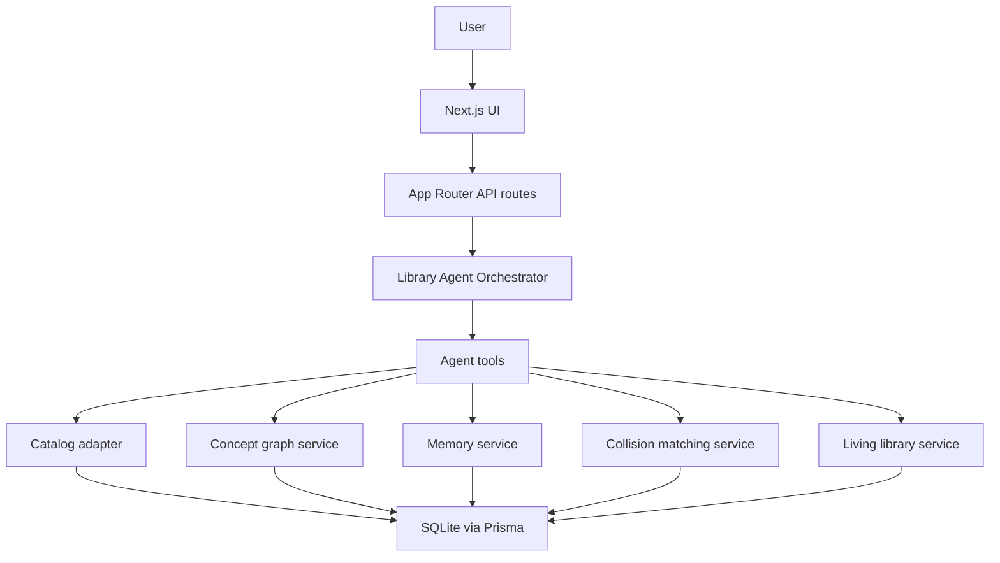

# Wormhole Library Agent engineering design

Version: 1.0  
Target implementer: Claude Code  
Primary goal: Build a runnable hackathon MVP, not a concept deck.  
Product position: A library-domain AI agent with controlled serendipity and feedback memory.

## 1. Problem framing

Wormhole Library Agent is not a generic knowledge recommendation app. It is a vertical library agent whose main job is to help a student use the library better:

1. Search and explain real library resources.
2. Turn a vague learning/research goal into a reading path.
3. Open a controlled "knowledge wormhole" from the user's current topic to unexpected but explainable library resources.
4. Match users with useful people when a knowledge collision is valuable.
5. Treat consenting people as "living library" resources.
6. Learn from feedback so future searches, wormholes, and matches become more accurate.

The key product sentence:

> Wormhole is an AI librarian that can find what you asked for, and also knows when to lead you to a shelf, paper, or person you never knew to search for.

## 2. Hackathon track mapping

| Track | Requirement signal from the prompt | Wormhole response |
|---|---|---|
| Track 2: Library evolution | Reimagine the library beyond a management/search system; examples include AI librarian, knowledge map, second brain, sleeping books, people studying similar questions meeting each other | Product body. Wormhole is first a library agent with catalog search, reading paths, shelf/location awareness, library resource cards, and library-space metaphors |
| Track 3: Serendipity | Technology should not only predict the next thing the user already wants; it should create useful accidents and unfamiliar encounters | Knowledge Wormhole, Serendipity Slider, Unknown Unknowns, and Knowledge Collision are the core innovation mechanisms |
| Track 4: Feedback memory | Agent should accept feedback, turn it into reusable preferences/rules/experience, and use it later while controlling cost and accuracy | Memory Compiler stores structured reading preferences, novelty preferences, difficulty tolerance, language preference, match comfort, and memory tests |

Important positioning rule:

Track 2 is the main category. Track 3 and Track 4 are capabilities inside the library agent.

## 3. Product definition

### 3.1 Product name

Wormhole Library Agent

### 3.2 Target users

1. Undergraduate students starting a course paper or project.
2. Graduate students exploring adjacent research areas.
3. Students who know a broad interest but do not know the right search keywords.
4. Students willing to share knowledge as "living books".

### 3.3 Core promise

Given a topic such as "I want to learn AI Agent for a project", Wormhole returns:

1. Direct library resources: books, papers, chapters, courses, and locations.
2. A normal reading path.
3. One to three knowledge wormholes that lead to unexpected but explainable resources.
4. Optional people matches through Knowledge Collision and Living Library.
5. A feedback interface that updates future behavior.

### 3.4 Non-goals

Do not build these in MVP:

1. Full university catalog integration.
2. AR indoor navigation.
3. Full Neo4j-scale knowledge graph.
4. Real-time chat between matched users.
5. Automatic import of all browsing/reading history.
6. Social network feed.
7. Complex multi-agent orchestration UI.

The MVP must feel like a library product even with seeded/demo data.

## 4. User flows

### 4.1 First-time research flow

```text
User opens app
  -> enters: "I want to learn AI Agent for a project"
  -> selects goal: project / beginner
  -> Wormhole searches library resources
  -> Wormhole shows direct resources and reading path
  -> User moves Serendipity Slider to "cross-disciplinary"
  -> Wormhole generates knowledge wormholes
  -> User opens one wormhole
  -> Wormhole explains the knowledge bridge and shows library resources
  -> User gives feedback: "interesting, but too math-heavy"
  -> Memory is updated
```

### 4.2 Returning user memory flow

```text
User asks: "Find me resources about Agent Memory"
  -> Agent retrieves memory:
     - Chinese or overview-first resources preferred
     - likes CS -> cognitive science wormholes
     - medium math tolerance
  -> Agent returns normal resources
  -> Agent proactively suggests:
     Agent Memory -> long-term memory -> human memory -> forgetting curve
  -> User accepts or rejects
```

### 4.3 Knowledge Collision flow

```text
User researches: "multi-agent coordination"
  -> Agent detects a collision candidate:
     another user studying "mechanism design in economics"
  -> Agent explains why the match exists:
     shared bridge = strategic behavior under rules
  -> Agent asks for opt-in:
     "Send an anonymous 15-minute discussion invitation?"
  -> Only after both users consent, reveal contact/channel
```

### 4.4 Living Library flow

```text
User searches: "I want to start robot learning"
  -> Results include:
     - books
     - papers
     - courses
     - living books
  -> A living book profile appears:
     "Student A, has built two robot navigation projects, willing to answer beginner questions"
  -> User requests a meeting
  -> Living book owner accepts or rejects
```

## 5. Core features

### 5.1 AI Librarian

Purpose: handle ordinary library tasks.

Capabilities:

1. Understand user intent: course, project, research, exam, curiosity.
2. Search books, papers, chapters, and living-library profiles.
3. Explain why each resource is useful.
4. Recommend reading order.
5. Show location/status for physical books.

MVP behavior:

Use seeded catalog data with realistic fields. If a real catalog API exists later, replace only the catalog adapter.

### 5.2 Knowledge Wormhole

Purpose: generate an explainable path from current topic to an unexpected library resource.

Example:

```text
Multi-Agent Systems
  -> Agent Coordination
  -> Game Theory
  -> Mechanism Design
  -> library book: An Introduction to Game Theory
```

Each wormhole must include:

1. Start concept.
2. 3-5 bridge concepts.
3. Destination concept.
4. At least one library resource or living-library profile at the destination.
5. Explanation in plain language.
6. Novelty, bridge, quality, and confidence scores.

### 5.3 Serendipity Slider

Purpose: let the user control how far from their comfort zone today's exploration should be.

UI labels:

| Slider range | Label | Meaning |
|---:|---|---|
| 0-20 | Nearby shelf | same field, slightly new |
| 21-40 | Next aisle | adjacent field |
| 41-60 | Across the floor | clear cross-field link |
| 61-80 | Another building | far but explainable |
| 81-100 | Throw me into space | very surprising, still bridged |

Algorithmic rule:

The slider is not decoration. It sets `target_novelty = slider / 100`.

### 5.4 Unknown Unknowns

Purpose: surface areas the user probably does not know to search for.

Definition:

An Unknown Unknown is a concept that:

1. Is not in the user's known/recent concept set.
2. Has a medium-to-high bridge score from the user's current topic.
3. Has enough library resources to explore.
4. Falls near the requested novelty target.

Example:

For "Agent Memory":

```text
Known: LangGraph memory, vector database, RAG
Unknown Unknowns:
  - cognitive psychology
  - forgetting curve
  - memory consolidation
  - personal information management
```

### 5.5 Knowledge Collision

Purpose: match people whose knowledge areas are different but mutually useful.

Not "similar interests". The value is complementarity.

Example:

```text
User A: multi-agent coordination
User B: mechanism design
Bridge: strategic behavior under constraints
Collision reason: A can bring implementation/agent systems; B can bring incentive/rule design
```

### 5.6 Living Library

Purpose: model people as opt-in library resources.

A living book is a person who explicitly consents to be discoverable for certain topics and interaction types.

Living book fields:

1. Display name or alias.
2. Expertise concepts.
3. Current interests.
4. Willing-to-help areas.
5. Difficulty level they can support.
6. Availability.
7. Consent scope.
8. Contact policy.

### 5.7 Feedback memory

Purpose: compile feedback into structured rules, not raw chat logs.

Feedback examples:

| User feedback | Memory update |
|---|---|
| "This is interesting, but too math-heavy" | Lower math tolerance for cross-disciplinary wormholes |
| "Give me Chinese intros first" | Set language preference to Chinese-first |
| "This was too close to what I already know" | Increase novelty target |
| "Don't match me with people unless I ask" | Set social matching mode to manual |
| "I like this CS -> psychology jump" | Increase domain affinity for cognitive science |

## 6. MVP boundary

### 6.1 Must build

1. Home/search page with AI librarian prompt.
2. Search results with library resources.
3. Serendipity Slider.
4. Wormhole generation with visible paths.
5. Feedback buttons and free-text feedback.
6. Memory summary panel.
7. People match cards with consent-safe mock flow.
8. Seeded catalog, concept graph, and living-library profiles.
9. Tests for algorithm scoring, memory compilation, API contracts, and at least one end-to-end demo path.

### 6.2 Can fake, but cleanly

1. Library catalog: seeded dataset with adapter interface.
2. Embeddings: deterministic local pseudo-embeddings or precomputed JSON vectors.
3. LLM: optional provider abstraction with deterministic fallback templates.
4. Contact request: store pending request, do not send real email/message.

### 6.3 Must not fake

1. Feedback must actually change later recommendations.
2. Slider value must actually change wormhole ranking.
3. Every wormhole must land on a resource or person.
4. People matching must require opt-in fields.
5. App must run locally from a clean clone.

## 7. System architecture

Use a single Next.js TypeScript app for MVP.

Recommended stack:

1. Next.js App Router.
2. TypeScript.
3. Prisma.
4. SQLite for hackathon local demo.
5. React Flow or Cytoscape.js for knowledge map visualization.
6. Tailwind CSS or existing project styling.
7. Vitest for unit tests.
8. Playwright for one end-to-end demo test.
9. Optional OpenAI-compatible LLM provider behind `LlmProvider`.

Architecture:



Core principle:

Keep services deterministic and testable. LLM calls should improve explanations, not be required for ranking correctness.

## 8. Agent tool design

The agent is an orchestrator that calls typed internal tools. Implement each tool as a TypeScript function with input/output schema validation.

### 8.1 Tool list

| Tool | Purpose | Must be deterministic |
|---|---|---|
| `searchCatalog` | Search books/papers/courses by concept/query | yes |
| `getResourceDetails` | Return location/status/chapter metadata | yes |
| `extractConcepts` | Convert user query into concept candidates | fallback yes, LLM optional |
| `getUserMemory` | Load structured memory for user/session | yes |
| `rankLibraryResources` | Rank normal search results | yes |
| `generateWormholes` | Generate candidate paths and scores | yes |
| `rankWormholes` | Apply novelty/bridge/quality/memory scoring | yes |
| `findKnowledgeCollisions` | Find complementary people matches | yes |
| `searchLivingLibrary` | Find opt-in living books | yes |
| `compileFeedbackMemory` | Convert feedback into memory patches | fallback yes, LLM optional |
| `recordInteraction` | Store query/results/feedback event | yes |

### 8.2 Tool contracts

```ts
export type SearchCatalogInput = {
  query: string;
  conceptIds?: string[];
  resourceTypes?: Array<"book" | "paper" | "course" | "thesis">;
  language?: "zh" | "en" | "any";
  limit?: number;
};

export type SearchCatalogResult = {
  resources: LibraryResourceCard[];
};
```

```ts
export type GenerateWormholesInput = {
  userId: string;
  startConceptIds: string[];
  sliderValue: number;
  maxPaths: number;
};

export type WormholePath = {
  id: string;
  startConceptId: string;
  bridgeConceptIds: string[];
  destinationConceptId: string;
  resourceIds: string[];
  livingBookIds: string[];
  novelty: number;
  noveltyFit: number;
  bridgeScore: number;
  qualityScore: number;
  diversityScore: number;
  finalScore: number;
  explanation: string;
};
```

```ts
export type CompileFeedbackMemoryInput = {
  userId: string;
  interactionId: string;
  targetType: "resource" | "wormhole" | "person_match";
  targetId: string;
  rating: "too_close" | "just_right" | "too_far" | "too_hard" | "not_relevant" | "useful";
  freeText?: string;
};

export type MemoryPatch = {
  key: string;
  value: unknown;
  confidenceDelta: number;
  reason: string;
};
```

## 9. Data model

### 9.1 Main entities

```text
User
Session
Concept
ConceptEdge
LibraryResource
ResourceConcept
LivingBookProfile
LivingBookConcept
UserConceptAffinity
UserMemory
Interaction
Feedback
WormholeRun
WormholePath
PersonMatch
ContactRequest
```

### 9.2 Concept model

Concepts are the shared language between resources, users, wormholes, and people.

```ts
type Concept = {
  id: string;
  name: string;
  aliases: string[];
  domain: string;
  description: string;
  embedding: number[];
  popularity: number;
  createdAt: Date;
};
```

### 9.3 Resource model

```ts
type LibraryResource = {
  id: string;
  type: "book" | "paper" | "course" | "thesis";
  title: string;
  authors: string[];
  year?: number;
  language: "zh" | "en";
  abstract?: string;
  location?: string;
  callNumber?: string;
  availability: "available" | "checked_out" | "online" | "unknown";
  difficulty: "intro" | "undergrad" | "graduate" | "research";
  qualityScore: number;
  sourceUrl?: string;
};
```

### 9.4 Memory model

Use structured memory instead of storing all chat as context.

Memory categories:

| Category | Keys |
|---|---|
| Reading preference | `language`, `resource_type_order`, `summary_first`, `max_results` |
| Difficulty | `math_tolerance`, `paper_density`, `preferred_level` |
| Serendipity | `default_slider`, `novelty_mean`, `novelty_std`, `liked_domains`, `disliked_domains` |
| Task preference | `coursework_strategy`, `research_strategy`, `project_strategy` |
| Social preference | `matching_mode`, `anonymous_first`, `living_book_opt_in` |
| Cost control | `memory_confidence`, `last_used_at`, `use_count` |

Example memory:

```json
{
  "userId": "demo-user",
  "reading": {
    "language": "zh_first",
    "resourceTypeOrder": ["book", "survey_paper", "paper"],
    "summaryFirst": true,
    "maxResults": 6
  },
  "difficulty": {
    "preferredLevel": "undergrad",
    "mathTolerance": 0.45,
    "paperDensity": 0.35
  },
  "serendipity": {
    "defaultSlider": 62,
    "noveltyMean": 0.62,
    "noveltyStd": 0.14,
    "likedDomains": ["Cognitive Science", "Economics"],
    "dislikedDomains": []
  },
  "social": {
    "matchingMode": "ask_first",
    "anonymousFirst": true,
    "livingBookOptIn": false
  }
}
```

## 10. Recommendation and wormhole algorithm

### 10.1 Concept extraction

Input:

```text
"I want to learn AI Agent for a project"
```

Output:

```json
{
  "concepts": ["AI Agent", "LLM Agent", "Tool Use", "Planning"],
  "taskType": "project",
  "level": "beginner"
}
```

Implementation:

1. First pass: keyword/alias matching against seeded `Concept`.
2. Optional LLM pass: use only if API key exists.
3. Always return deterministic fallback.

### 10.2 User vector

Compute from recent interactions and memory:

```text
user_vector =
  weighted_average(
    recent_query_concepts * 0.45,
    clicked_resource_concepts * 0.25,
    positive_feedback_concepts * 0.20,
    explicit_profile_concepts * 0.10
  )
```

For a first-time demo user, use concepts extracted from the current query.

### 10.3 Novelty

```text
similarity = cosine(user_vector, candidate_concept_vector)
novelty = 1 - similarity
target_novelty = slider_value / 100
novelty_fit = 1 - abs(novelty - target_novelty)
```

Clamp all values to `[0, 1]`.

### 10.4 Bridge score

A wormhole must have a bridge. Use concept graph paths.

For each candidate destination concept:

1. Find paths of length 2-5 from start concept to destination.
2. Score each path:

```text
path_strength = average(edge.weight)
path_explainability = 1 - ((path_length - 3)^2 / 9)
bridge_score = 0.65 * path_strength + 0.35 * path_explainability
```

Reject candidates with:

```text
bridge_score < 0.35
```

### 10.5 Quality score

```text
quality_score =
  0.45 * max_resource_quality
  + 0.25 * availability_score
  + 0.20 * resource_count_score
  + 0.10 * difficulty_fit
```

Availability:

| Status | Score |
|---|---:|
| available | 1.0 |
| online | 0.9 |
| checked_out | 0.4 |
| unknown | 0.5 |

### 10.6 Diversity score

Prevent all wormholes from going to the same domain.

```text
diversity_score = 1 - max_similarity_to_already_selected_destination
```

For first candidate, `diversity_score = 1`.

### 10.7 Final score

```text
final_score =
  0.40 * bridge_score
  + 0.30 * novelty_fit
  + 0.20 * quality_score
  + 0.10 * diversity_score
```

Memory adjustment:

```text
if destination.domain in memory.serendipity.likedDomains:
  final_score += 0.05

if destination.domain in memory.serendipity.dislikedDomains:
  final_score -= 0.08

if destination requires math and memory.difficulty.mathTolerance < 0.4:
  final_score -= 0.10
```

### 10.8 Pseudocode

```ts
export async function generateWormholes(input: GenerateWormholesInput) {
  const memory = await getUserMemory(input.userId);
  const userVector = await buildUserVector(input.userId, input.startConceptIds);
  const targetNovelty = input.sliderValue / 100;
  const destinations = await findCandidateDestinations(input.startConceptIds);

  const scored = [];
  for (const destination of destinations) {
    const paths = findConceptPaths(input.startConceptIds, destination.id, { min: 2, max: 5 });
    const bestPath = scoreAndPickBestPath(paths);
    if (!bestPath || bestPath.bridgeScore < 0.35) continue;

    const novelty = 1 - cosine(userVector, destination.embedding);
    const noveltyFit = 1 - Math.abs(novelty - targetNovelty);
    const resources = await findResourcesByConcept(destination.id);
    const livingBooks = await findLivingBooksByConcept(destination.id);
    if (resources.length === 0 && livingBooks.length === 0) continue;

    const qualityScore = scoreQuality(resources, livingBooks, memory);
    scored.push({
      destination,
      bestPath,
      resources,
      livingBooks,
      novelty,
      noveltyFit,
      qualityScore
    });
  }

  return selectDiverseTopK(scored, input.maxPaths, memory);
}
```

## 11. Person matching mechanism

### 11.1 Match types

| Type | Meaning |
|---|---|
| Similar research | Two users study close topics |
| Complementary collision | Two users study different topics connected by a strong bridge |
| Mentor living book | One user can help another at the right difficulty level |
| Unknown unknown guide | One user has experience in a domain the other is entering |

MVP should focus on complementary collision and mentor living book.

### 11.2 Collision score

For user A and user B:

```text
topic_distance = 1 - cosine(A.vector, B.vector)
bridge_strength = max_bridge_score(A.concepts, B.concepts)
complementarity = count(B.expertise intersects A.unknown_unknowns) normalized
availability = B.opt_in && compatible_time ? 1 : 0
privacy_ok = both users allow matching ? 1 : 0

collision_score =
  0.30 * topic_distance_fit
  + 0.30 * bridge_strength
  + 0.25 * complementarity
  + 0.10 * availability
  + 0.05 * prior_feedback_fit
```

Where:

```text
topic_distance_fit = 1 - abs(topic_distance - 0.55)
```

Reason:

People should not be identical, but also not unrelated.

### 11.3 Privacy-safe match flow

1. System computes match.
2. User sees anonymous explanation:
   "A student studying mechanism design may help your multi-agent coordination project."
3. User can request contact.
4. Other user receives request with requester-visible profile.
5. Only after acceptance is contact revealed.

No direct identity reveal in recommendation cards.

## 12. Living Library model

### 12.1 Concept

In Wormhole, a person can be a library resource only through explicit consent.

Living Library changes the library from:

```text
books + papers
```

to:

```text
books + papers + people + experience
```

### 12.2 Profile states

| State | Meaning |
|---|---|
| private | user has no living-book profile |
| discoverable_anonymous | can appear as anonymous living book |
| discoverable_named | display name can be shown |
| paused | temporarily hidden |

### 12.3 Interaction types

| Type | Meaning |
|---|---|
| async_answer | user accepts written questions |
| coffee_chat | user accepts 15-minute meeting |
| project_review | user can review a project idea |
| reading_guide | user can suggest first resources |

### 12.4 Ranking living books

```text
living_book_score =
  0.35 * expertise_match
  + 0.20 * difficulty_fit
  + 0.20 * willingness_match
  + 0.15 * availability
  + 0.10 * past_helpfulness
```

## 13. Memory structure and update rules

### 13.1 Memory Compiler

Convert feedback into durable structured memory.

Raw feedback:

```text
"This economics wormhole is interesting, but the math is too hard."
```

Compiled memory patches:

```json
[
  {
    "key": "serendipity.likedDomains",
    "operation": "add_or_increment",
    "value": "Economics",
    "confidenceDelta": 0.08,
    "reason": "User said economics wormhole is interesting"
  },
  {
    "key": "difficulty.mathTolerance",
    "operation": "decrement",
    "value": 0.08,
    "confidenceDelta": 0.10,
    "reason": "User said math is too hard"
  }
]
```

### 13.2 Memory confidence

Each memory item has:

```ts
type UserMemoryItem = {
  id: string;
  userId: string;
  category: string;
  key: string;
  valueJson: unknown;
  confidence: number;
  source: "explicit_feedback" | "implicit_click" | "profile" | "system_inferred";
  useCount: number;
  successCount: number;
  lastUsedAt?: Date;
};
```

Update confidence:

```text
explicit feedback: +0.10 to +0.25
accepted recommendation using memory: +0.05
rejected recommendation using memory: -0.08
unused for long time: decay by 0.02 per week in future work
```

### 13.3 Memory retrieval budget

Do not inject all memory into every agent call.

For each task, retrieve:

1. Always: reading preference, difficulty, serendipity.
2. If social feature is invoked: social preference.
3. If task type is known: matching task preference.

Limit memory context:

```text
max 12 memory items
max 1200 characters rendered into LLM prompt
```

Ranking memory items:

```text
memory_relevance =
  0.45 * task_key_match
  + 0.25 * confidence
  + 0.15 * recency
  + 0.15 * historical_success_rate
```

### 13.4 Memory unit tests

Create deterministic tests from important feedback.

Example:

```ts
it("uses Chinese overview-first resources for demo user", async () => {
  await seedMemory("demo-user", {
    reading: { language: "zh_first", resourceTypeOrder: ["book", "survey_paper", "paper"] }
  });

  const result = await searchAndRankResources({
    userId: "demo-user",
    query: "Diffusion Model"
  });

  expect(result.resources[0].language).toBe("zh");
  expect(result.resources[0].difficulty).not.toBe("research");
});
```

## 14. Privacy and safety

### 14.1 Data minimization

Store only what the MVP needs:

1. Query text.
2. Extracted concepts.
3. Clicked resource IDs.
4. Feedback.
5. Structured memory.
6. Living-library consent fields.

Do not store:

1. Full chat logs forever.
2. Private notes by default.
3. Real contact information in demo seed data.
4. Hidden identity in anonymous match cards.

### 14.2 Consent rules

1. Users are not living books unless they opt in.
2. Contact is hidden until both sides accept.
3. Matching can be disabled.
4. A living book can pause discoverability.
5. The UI must show why a person appeared.

### 14.3 Recommendation safety

1. Do not recommend people for medical, legal, or high-risk counseling.
2. Do not infer sensitive traits.
3. Do not show "this person knows X" unless the profile explicitly lists X.
4. Do not overstate resource availability if it is mock or unknown.

### 14.4 Demo disclosure

If using seeded data, display a small "Demo catalog" label in development/demo mode.

## 15. API design

Base path: `/api`

### 15.1 Create search session

`POST /api/search`

Request:

```json
{
  "userId": "demo-user",
  "query": "I want to learn AI Agent for a project",
  "taskType": "project",
  "level": "beginner",
  "sliderValue": 60
}
```

Response:

```json
{
  "interactionId": "int_001",
  "concepts": [
    { "id": "c_ai_agent", "name": "AI Agent" }
  ],
  "resources": [
    {
      "id": "r_aima",
      "type": "book",
      "title": "Artificial Intelligence: A Modern Approach",
      "why": "Start with the Intelligent Agents chapter for a project-level overview.",
      "location": "Main Library 3F TP Area",
      "availability": "available",
      "difficulty": "undergrad"
    }
  ],
  "readingPath": [
    "AI Agent",
    "Planning",
    "Tool Use",
    "Memory",
    "Multi-Agent Systems"
  ],
  "memoryUsed": [
    "overview-first resources",
    "medium novelty preference"
  ]
}
```

### 15.2 Generate wormholes

`POST /api/wormholes`

Request:

```json
{
  "userId": "demo-user",
  "interactionId": "int_001",
  "startConceptIds": ["c_ai_agent"],
  "sliderValue": 70,
  "maxPaths": 3
}
```

Response:

```json
{
  "wormholes": [
    {
      "id": "wh_001",
      "path": [
        "AI Agent",
        "Multi-Agent Coordination",
        "Game Theory",
        "Mechanism Design"
      ],
      "destination": "Mechanism Design",
      "explanation": "You are studying how agents coordinate. Mechanism design studies how rules shape strategic behavior.",
      "scores": {
        "novelty": 0.68,
        "bridge": 0.82,
        "quality": 0.77,
        "final": 0.78
      },
      "resources": ["r_game_theory_intro"],
      "livingBooks": ["lb_econ_student_anonymous"]
    }
  ]
}
```

### 15.3 Submit feedback

`POST /api/feedback`

Request:

```json
{
  "userId": "demo-user",
  "interactionId": "int_001",
  "targetType": "wormhole",
  "targetId": "wh_001",
  "rating": "too_hard",
  "freeText": "Interesting, but the math part is too difficult."
}
```

Response:

```json
{
  "memoryPatches": [
    {
      "key": "serendipity.likedDomains",
      "value": "Economics",
      "reason": "User found the economics wormhole interesting."
    },
    {
      "key": "difficulty.mathTolerance",
      "value": 0.37,
      "reason": "User found the math too difficult."
    }
  ],
  "memorySummary": {
    "defaultSlider": 62,
    "mathTolerance": 0.37,
    "likedDomains": ["Economics"]
  }
}
```

### 15.4 Get memory

`GET /api/memory?userId=demo-user`

Response:

```json
{
  "memory": {
    "reading": {
      "language": "zh_first",
      "resourceTypeOrder": ["book", "survey_paper", "paper"]
    },
    "difficulty": {
      "preferredLevel": "undergrad",
      "mathTolerance": 0.37
    },
    "serendipity": {
      "defaultSlider": 62,
      "likedDomains": ["Economics"]
    }
  }
}
```

### 15.5 Find people matches

`POST /api/matches`

Request:

```json
{
  "userId": "demo-user",
  "conceptIds": ["c_multi_agent_coordination"],
  "mode": "collision"
}
```

Response:

```json
{
  "matches": [
    {
      "id": "pm_001",
      "displayMode": "anonymous",
      "headline": "A student studying mechanism design may help your coordination question.",
      "bridge": ["Multi-Agent Coordination", "Game Theory", "Mechanism Design"],
      "collisionReason": "You bring agent implementation; they bring incentive design.",
      "contactState": "request_required"
    }
  ]
}
```

### 15.6 Create contact request

`POST /api/contact-requests`

Request:

```json
{
  "userId": "demo-user",
  "personMatchId": "pm_001",
  "message": "I am working on a multi-agent project and would love a 15-minute chat."
}
```

Response:

```json
{
  "requestId": "cr_001",
  "status": "pending"
}
```

## 16. Database schema

Implement this as `prisma/schema.prisma`. SQLite is sufficient for MVP.

```prisma
model User {
  id          String   @id @default(cuid())
  name        String?
  createdAt   DateTime @default(now())
  sessions    Session[]
  memories    UserMemory[]
  interactions Interaction[]
  livingBookProfile LivingBookProfile?
}

model Session {
  id        String   @id @default(cuid())
  userId    String
  user      User     @relation(fields: [userId], references: [id])
  createdAt DateTime @default(now())
}

model Concept {
  id          String   @id
  name        String
  aliasesJson String   @default("[]")
  domain      String
  description String
  embeddingJson String @default("[]")
  popularity  Float    @default(0.5)
  outgoingEdges ConceptEdge[] @relation("ConceptFrom")
  incomingEdges ConceptEdge[] @relation("ConceptTo")
  resourceLinks ResourceConcept[]
  livingBookLinks LivingBookConcept[]
}

model ConceptEdge {
  id            String @id @default(cuid())
  fromConceptId String
  toConceptId   String
  relation      String
  weight        Float  @default(0.5)
  explanation   String
  fromConcept   Concept @relation("ConceptFrom", fields: [fromConceptId], references: [id])
  toConcept     Concept @relation("ConceptTo", fields: [toConceptId], references: [id])

  @@index([fromConceptId])
  @@index([toConceptId])
}

model LibraryResource {
  id           String @id
  type         String
  title        String
  authorsJson  String @default("[]")
  year         Int?
  language     String
  abstract     String?
  location     String?
  callNumber   String?
  availability String
  difficulty   String
  qualityScore Float  @default(0.5)
  sourceUrl    String?
  concepts     ResourceConcept[]
}

model ResourceConcept {
  id         String @id @default(cuid())
  resourceId String
  conceptId  String
  weight     Float @default(1.0)
  resource   LibraryResource @relation(fields: [resourceId], references: [id])
  concept    Concept @relation(fields: [conceptId], references: [id])

  @@unique([resourceId, conceptId])
  @@index([conceptId])
}

model LivingBookProfile {
  id              String @id @default(cuid())
  userId          String @unique
  user            User   @relation(fields: [userId], references: [id])
  displayName     String?
  displayMode     String @default("anonymous")
  bio             String?
  expertiseLevel  String @default("peer")
  willingTypesJson String @default("[]")
  availabilityJson String @default("{}")
  consentState    String @default("private")
  helpfulnessScore Float @default(0.5)
  concepts        LivingBookConcept[]
}

model LivingBookConcept {
  id              String @id @default(cuid())
  livingBookId    String
  conceptId       String
  relation        String
  weight          Float @default(1.0)
  livingBook      LivingBookProfile @relation(fields: [livingBookId], references: [id])
  concept         Concept @relation(fields: [conceptId], references: [id])

  @@unique([livingBookId, conceptId, relation])
  @@index([conceptId])
}

model UserMemory {
  id          String   @id @default(cuid())
  userId      String
  user        User     @relation(fields: [userId], references: [id])
  category    String
  key         String
  valueJson   String
  confidence  Float    @default(0.5)
  source      String
  useCount    Int      @default(0)
  successCount Int     @default(0)
  lastUsedAt  DateTime?
  createdAt   DateTime @default(now())
  updatedAt   DateTime @updatedAt

  @@unique([userId, category, key])
}

model Interaction {
  id              String   @id @default(cuid())
  userId          String
  user            User     @relation(fields: [userId], references: [id])
  query           String
  taskType        String?
  level           String?
  sliderValue     Int
  extractedConceptsJson String @default("[]")
  createdAt       DateTime @default(now())
  feedback        Feedback[]
  wormholeRuns    WormholeRun[]
}

model Feedback {
  id            String   @id @default(cuid())
  interactionId String
  interaction   Interaction @relation(fields: [interactionId], references: [id])
  userId        String
  targetType    String
  targetId      String
  rating        String
  freeText      String?
  memoryPatchesJson String @default("[]")
  createdAt     DateTime @default(now())
}

model WormholeRun {
  id             String @id @default(cuid())
  interactionId  String
  interaction    Interaction @relation(fields: [interactionId], references: [id])
  userId         String
  startConceptsJson String
  sliderValue    Int
  createdAt      DateTime @default(now())
  paths          WormholePath[]
}

model WormholePath {
  id             String @id @default(cuid())
  runId          String
  run            WormholeRun @relation(fields: [runId], references: [id])
  pathConceptsJson String
  destinationConceptId String
  resourceIdsJson String @default("[]")
  livingBookIdsJson String @default("[]")
  novelty        Float
  noveltyFit     Float
  bridgeScore    Float
  qualityScore   Float
  diversityScore Float
  finalScore     Float
  explanation    String
}

model PersonMatch {
  id              String @id @default(cuid())
  requesterUserId String
  targetUserId    String
  matchType       String
  bridgeConceptsJson String
  score           Float
  explanation     String
  status          String @default("suggested")
  createdAt       DateTime @default(now())
}

model ContactRequest {
  id             String @id @default(cuid())
  personMatchId  String
  requesterUserId String
  targetUserId   String
  message        String
  status         String @default("pending")
  createdAt      DateTime @default(now())
}
```

## 17. Frontend pages

### 17.1 `/`

Main AI librarian interface.

Visible components:

1. Query input: "What are you trying to explore in the library today?"
2. Goal chips: course, project, research, exam, curiosity.
3. Level chips: beginner, undergraduate, graduate, research.
4. Submit button.
5. Demo seed examples.

No marketing hero. The first screen is the usable agent.

### 17.2 `/explore/[interactionId]`

Core results page.

Layout:

1. Left: AI librarian answer and direct resources.
2. Right/top: Serendipity Slider.
3. Center: reading path and wormhole cards.
4. Bottom: feedback controls.

Resource card fields:

1. title
2. type
3. why this resource
4. location/status
5. difficulty
6. concepts

Wormhole card fields:

1. path visualization
2. "why this jump works"
3. destination resources
4. novelty/bridge labels
5. feedback buttons

### 17.3 `/map/[interactionId]`

Knowledge map view.

Use React Flow or Cytoscape.js.

Nodes:

1. current topic
2. bridge concepts
3. destination concepts
4. resources
5. living books

Edges:

1. concept relation
2. resource grounding
3. person expertise

### 17.4 `/memory`

Memory transparency page.

Show:

1. reading preference
2. difficulty preference
3. serendipity preference
4. social preference
5. recent memory updates

Allow:

1. reset demo memory
2. disable social matching
3. change default slider

### 17.5 `/living-library`

Living Library profile page.

For MVP:

1. Toggle discoverability.
2. Choose anonymous/named mode.
3. Add expertise concepts.
4. Add willing-to-help types.
5. Show incoming contact requests.

## 18. Repo structure

```text
wormhole-library-agent/
  app/
    page.tsx
    explore/[interactionId]/page.tsx
    map/[interactionId]/page.tsx
    memory/page.tsx
    living-library/page.tsx
    api/
      search/route.ts
      wormholes/route.ts
      feedback/route.ts
      memory/route.ts
      matches/route.ts
      contact-requests/route.ts
  components/
    LibrarianSearchBox.tsx
    ResourceCard.tsx
    SerendipitySlider.tsx
    WormholeCard.tsx
    KnowledgeMap.tsx
    MemoryPanel.tsx
    LivingBookCard.tsx
    FeedbackBar.tsx
  lib/
    agent/
      orchestrator.ts
      prompts.ts
      tools.ts
    catalog/
      adapter.ts
      seedCatalogAdapter.ts
      ranking.ts
    concepts/
      conceptExtraction.ts
      graph.ts
      vectors.ts
    wormhole/
      generate.ts
      score.ts
      paths.ts
    memory/
      getMemory.ts
      compileFeedback.ts
      applyPatch.ts
      renderMemoryContext.ts
    matching/
      collision.ts
      livingLibrary.ts
      consent.ts
    llm/
      provider.ts
      deterministicProvider.ts
      openaiCompatibleProvider.ts
    db/
      prisma.ts
    validation/
      schemas.ts
  prisma/
    schema.prisma
    seed.ts
  data/
    seed-concepts.json
    seed-edges.json
    seed-resources.json
    seed-living-books.json
  tests/
    unit/
      wormhole-score.test.ts
      memory-compiler.test.ts
      collision-score.test.ts
      catalog-ranking.test.ts
    e2e/
      demo-flow.spec.ts
  docs/
    demo-script.md
    product-notes.md
  package.json
  README.md
  .env.example
```

## 19. Implementation priority

### Phase 1: Deterministic core

Build first:

1. Prisma schema and seed data.
2. Catalog search and ranking.
3. Concept extraction fallback.
4. Wormhole path generation and scoring.
5. Feedback memory compilation.
6. Unit tests.

Acceptance:

Given query "AI Agent" and slider 70, the system returns a wormhole to "Mechanism Design" or "Cognitive Psychology" with a valid bridge and resource.

### Phase 2: UI vertical slice

Build:

1. Home page.
2. Explore results page.
3. Slider-triggered wormhole regeneration.
4. Feedback buttons update memory.
5. Memory panel shows changed preferences.

Acceptance:

The judge can use the app without reading instructions.

### Phase 3: People layer

Build:

1. Living book seed profiles.
2. Collision matching service.
3. Anonymous match cards.
4. Contact request mock flow.

Acceptance:

For "multi-agent coordination", the app suggests an anonymous mechanism-design living book and explains the bridge.

### Phase 4: Polish and demo reliability

Build:

1. Knowledge map page.
2. Better card copy.
3. Demo reset button.
4. Playwright demo flow.
5. README with one-command setup.

Acceptance:

Fresh install runs seed, starts app, and completes demo flow.

## 20. Tests and acceptance

### 20.1 Unit tests

Required tests:

1. `noveltyFit` peaks when candidate novelty matches slider.
2. Wormhole candidates without resources are rejected.
3. Low bridge score candidates are rejected.
4. Memory feedback "too hard" lowers math tolerance.
5. Memory feedback "too close" raises default novelty.
6. Liked domain adds a positive score adjustment.
7. Social match is hidden if living book consent is private.
8. Collision score prefers medium distance over identical users.

### 20.2 API tests

Required:

1. `POST /api/search` returns interaction ID and resources.
2. `POST /api/wormholes` returns paths grounded in resources.
3. `POST /api/feedback` returns memory patches.
4. `GET /api/memory` reflects feedback update.
5. `POST /api/matches` returns only consent-safe matches.

### 20.3 E2E test

Demo path:

1. Open home.
2. Search "I want to learn AI Agent for a project".
3. See direct library resources.
4. Move slider to 70.
5. Generate wormholes.
6. Open "Mechanism Design" wormhole.
7. Submit "interesting but too math-heavy".
8. Open memory page and verify math tolerance changed.

### 20.4 Human acceptance checklist

The MVP is accepted only if:

1. It feels like a library agent before it feels like a generic chatbot.
2. Every wormhole has a visible path.
3. Every wormhole lands on a real seeded resource or living book.
4. Slider changes ranking in an obvious way.
5. Feedback changes later behavior.
6. People recommendations are opt-in and privacy-safe.
7. Demo can be completed in under 3 minutes.

## 21. Demo script

### 21.1 Opening

"Most library AI products answer what you already know how to ask. Wormhole helps with the harder problem: the knowledge you did not know you should search for."

### 21.2 Step 1: AI librarian

Input:

```text
I want to learn AI Agent for a project. I am a beginner.
```

Show:

1. Books.
2. Papers or surveys.
3. Reading path.
4. Library location/status.

Say:

"This is the normal librarian layer. It grounds everything in library resources."

### 21.3 Step 2: Serendipity Slider

Move slider to 70.

Say:

"Now I am telling the librarian I want to leave my comfort zone, but not randomly."

Show wormhole:

```text
AI Agent
  -> Multi-Agent Coordination
  -> Game Theory
  -> Mechanism Design
```

Say:

"The jump is surprising, but explainable. It also lands on a real book."

### 21.4 Step 3: Unknown Unknowns

Show a card:

```text
You probably would not search for: Mechanism Design
Why it matters: It studies how rules shape strategic behavior, which is central to multi-agent coordination.
```

### 21.5 Step 4: Knowledge Collision

Show anonymous match:

```text
A student studying mechanism design may help your multi-agent project.
```

Say:

"This is not people-you-may-know. It is people you should accidentally know."

### 21.6 Step 5: Feedback memory

Submit:

```text
Interesting, but the math part is too difficult.
```

Show memory update:

```text
Cross-disciplinary interest: increased
Economics affinity: increased
Math tolerance: decreased
```

Say:

"The agent did not just save a chat log. It compiled feedback into behavior rules."

### 21.7 Closing

"Wormhole turns the library from a search box into a living knowledge network: books, papers, shelves, and people, connected by an agent that remembers what kinds of accidents are useful to you."

## 22. Claude Code execution rules

Claude Code must follow these rules exactly.

### 22.1 Build rules

1. Build a runnable MVP, not a prototype shell.
2. Use the stack in this document unless the existing repo already has a stack.
3. Keep the first vertical slice small and complete.
4. Prefer deterministic services over LLM-only behavior.
5. All LLM behavior must have a deterministic fallback.
6. Do not add Neo4j, Qdrant, separate FastAPI, auth providers, or real messaging services in MVP.
7. Do not implement AR navigation.
8. Do not expose contact identity before consent.
9. Do not leave placeholder buttons that do nothing.
10. Do not create pages that only explain the idea; every page must perform a user action.

### 22.2 Development sequence

Claude Code should implement in this order:

1. Initialize project if none exists.
2. Add Prisma schema.
3. Add seed datasets.
4. Implement concept graph and scoring functions.
5. Implement memory compiler.
6. Implement API routes.
7. Implement UI components.
8. Implement pages.
9. Add tests.
10. Run verification.
11. Write README and demo script.

### 22.3 Verification commands

At minimum:

```bash
npm run lint
npm run test
npm run build
```

If Playwright is installed:

```bash
npm run test:e2e
```

### 22.4 Seed data requirements

Seed data must include at least:

1. 50 concepts.
2. 80 concept edges.
3. 30 library resources.
4. 6 living book profiles.
5. 1 demo user.
6. 3 preloaded memory items for the demo user.

Required demo concept chains:

```text
AI Agent -> Multi-Agent Coordination -> Game Theory -> Mechanism Design
AI Agent -> Agent Memory -> Human Memory -> Cognitive Psychology -> Forgetting Curve
Transformer -> Information Theory -> Statistical Physics -> Phase Transition
RAG -> Information Retrieval -> Library Science -> Personal Knowledge Management
```

Required demo resources:

1. Artificial Intelligence: A Modern Approach.
2. Multiagent Systems.
3. An Introduction to Game Theory.
4. Cognitive Psychology and Its Implications.
5. Introduction to Information Retrieval.
6. A library-science or knowledge-management resource.

### 22.5 UI quality rules

1. The first screen must be the agent input, not a marketing landing page.
2. Use stable card sizes and avoid layout shift.
3. Slider labels must explain distance without long instruction text.
4. Resource cards must show location/status.
5. Wormhole paths must be visually scannable.
6. Feedback controls must be one click plus optional text.
7. Memory updates must be visible immediately after feedback.

### 22.6 Definition of done

The task is done when:

1. The app runs locally.
2. The demo script works from a fresh database seed.
3. Unit tests pass.
4. Build passes.
5. README explains setup, seed, run, test, and demo path.
6. The final app clearly presents Wormhole as a library-domain agent.

## 23. README quick start content

Claude Code should include this in the final README:

```bash
npm install
npm run db:push
npm run db:seed
npm run dev
```

Then open:

```text
http://localhost:3000
```

Demo query:

```text
I want to learn AI Agent for a project. I am a beginner.
```

## 24. Final implementation note

The product should never explain itself as "a combination of tracks 2, 3, and 4" in the UI. That is only for judging and documentation.

In the product, it should feel like one coherent thing:

> A librarian who knows the library, remembers how you learn, and can open useful wormholes to books, papers, shelves, and people you would not have found alone.
